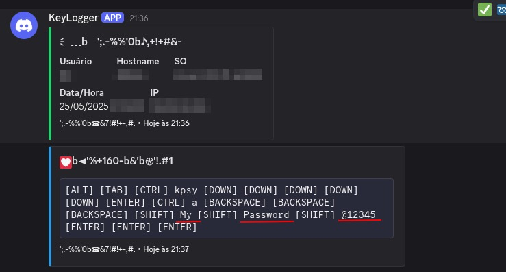
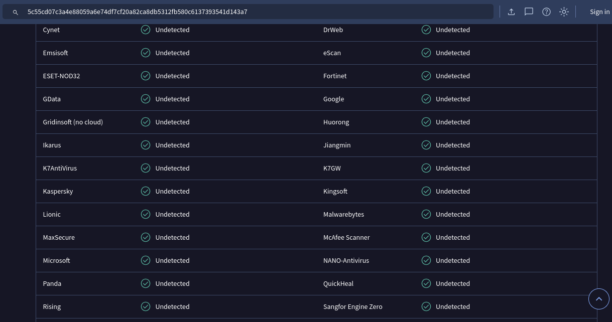

# 🎮 Keylogger Educacional

[](https://www.python.org)
[](LICENSE)
[](https://github.com/seu-usuario/keylogger)
[](https://discord.com)

> ⚠️ **AVISO**: Este projeto foi desenvolvido exclusivamente para fins educacionais e de aprendizado sobre segurança cibernética.

## 📋 Sobre o Projeto

Este é um keylogger educacional que demonstra conceitos de captura de entrada do teclado e integração com webhooks do Discord. O projeto foi criado para fins de estudo e compreensão de conceitos de segurança e automação.

## 🎥 Demonstração



## ✨ Características

- 🔍 Captura de teclas em tempo real
- 📤 Envio automático para o Discord a cada 60 segundos
- 🎨 Embeds bonitos e organizados
- 🔒 Código ofuscado para fácil integração
- 🔐 Uso de variáveis de ambiente para segurança
- 🛡️ Sistema de proteção contra detecção

## 🚀 Começando

### Pré-requisitos

- Python 3.8 ou superior
- pip (gerenciador de pacotes Python)
- Conta no Discord (para criar webhook)

### Instalação

1. Clone o repositório:
```bash
git clone https://github.com/seu-usuario/keylogger.git
cd keylogger
```

2. Instale as dependências:
```bash
pip install -r requirements.txt
```

3. Configure o ambiente:
   - Crie um arquivo `.env` na raiz do projeto
   - Adicione seu webhook do Discord:
   ```
   DISCORD_WEBHOOK_URL=seu_webhook_aqui
   ```

4. Execute o programa:
```bash
python main.py
```

## 📦 Estrutura do Projeto

```
keylogger/
├── main.py           # Arquivo principal
├── requirements.txt  # Dependências
├── .env             # Configurações (não versionado)
└── README.md        # Este arquivo
```

## ⚠️ Aviso Legal

Este software foi criado **APENAS** para fins educacionais. O uso indevido deste software pode ser ilegal em sua jurisdição. O autor não se responsabiliza pelo uso indevido deste software.

## 📝 Licença

Este projeto está sob a licença MIT. Veja o arquivo [LICENSE](LICENSE) para mais detalhes.

## 🤝 Contribuindo

Contribuições são sempre bem-vindas! Sinta-se à vontade para abrir uma issue ou enviar um pull request.

1. Faça um Fork do projeto
2. Crie sua Feature Branch (`git checkout -b feature/AmazingFeature`)
3. Commit suas mudanças (`git commit -m 'Add some AmazingFeature'`)
4. Push para a Branch (`git push origin feature/AmazingFeature`)
5. Abra um Pull Request

## 📧 Contato

Ariel Sousa - contatoarielsousa@gmail.com

Link do Projeto: [https://github.com/ArielRSousa/webhook-keylogger](https://github.com/ArielRSousa/webhook-keylogger)

## 🛡️ Análise de Segurança

### VirusTotal


> **Nota**: O resultado do VirusTotal mostra que o código é seguro e não contém malware. Os falsos positivos são comuns em ferramentas de segurança devido à natureza do código. 